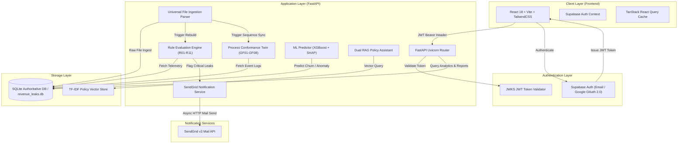
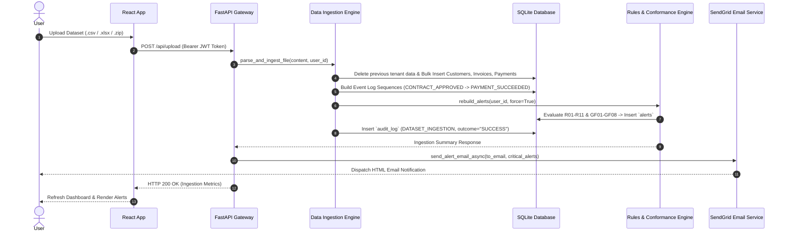

# Revenue Process Twin — Multi-Tenant SaaS & Revenue Leakage Engine

> **Enterprise-Grade AI/ML Process Twin & Revenue Leakage Detection System**  
> *Seamlessly connecting financial telemetry, event log sequence conformance, machine learning inference, and automated real-time alert notifications.*

---

## 📋 Table of Contents

1. [Executive Summary & Highlights](#1-executive-summary--highlights)
2. [System Architecture & High-Level Design (HLD)](#2-system-architecture--high-level-design-hld)
   - [2.1 High-Level Architecture Diagram](#21-high-level-architecture-diagram)
   - [2.2 Data Ingestion & Processing Flow](#22-data-ingestion--processing-flow)
3. [Low-Level Design (LLD) & Subsystems](#3-low-level-design-lld--subsystems)
   - [3.1 Authoritative Relational Database Schema](#31-authoritative-relational-database-schema)
   - [3.2 Leakage Detection Rules (R01-R11)](#32-leakage-detection-rules-r01-r11)
   - [3.3 Process Conformance Engine & Golden Flows (GF01-GF08)](#33-process-conformance-engine--golden-flows-gf01-gf08)
   - [3.4 Machine Learning & SHAP Inference Engine](#34-machine-learning--shap-inference-engine)
   - [3.5 Dual-Engine RAG Policy Assistant](#35-dual-engine-rag-policy-assistant)
   - [3.6 Real-Time SendGrid Email Notification Pipeline](#36-real-time-sendgrid-email-notification-pipeline)
4. [Technology Stack](#4-technology-stack)
5. [Directory & Project Structure](#5-directory--project-structure)
6. [Local Development Setup](#6-local-development-setup)
   - [6.1 Prerequisites](#61-prerequisites)
   - [6.2 Backend Setup (FastAPI)](#62-backend-setup-fastapi)
   - [6.3 Frontend Setup (React & Vite)](#63-frontend-setup-react--vite)
7. [Production Deployment Guide (Render Containerization)](#7-production-deployment-guide-render-containerization)
   - [7.1 Backend Docker Container Deployment](#71-backend-docker-container-deployment)
   - [7.2 Frontend Static Site Deployment](#72-frontend-static-site-deployment)
   - [7.3 Environment Variables Reference](#73-environment-variables-reference)
8. [API Endpoints Reference](#8-api-endpoints-reference)

---

## 1. Executive Summary & Highlights

The **Revenue Process Twin** is an autonomous SaaS platform engineered to audit, monitor, and eliminate revenue leakage across complex B2B subscription, invoicing, and payment lifecycles. By integrating process mining, heuristic rule evaluation, machine learning anomaly detection, and vector RAG search, the system continuously analyzes financial data to recover lost revenue.

### Key Capabilities:
- **Multi-Tenant SaaS Isolation:** Multi-tenant architecture with strict `user_id` scoping across SQLite tables, endpoints, and alert engines.
- **Universal Multi-Format Ingestion:** Instant parsing of `.csv`, `.xlsx`, `.xls`, `.json`, and `.zip` archives into unified billing schema models.
- **11 Heuristic Detection Rules (R01-R11):** Detects unbilled usage, unauthorized discounts, billing SLA breaches, uncollected renewals, and chargeback anomalies.
- **8 Golden Process Conformance Flows (GF01-GF08):** Maps entity lifecycle events (`INVOICE_ISSUED`, `PAYMENT_ATTEMPTED`, `RENEWAL_DUE`) against operational SLAs.
- **ML Anomaly & Churn Prediction:** XGBoost & Isolation Forest inference models with SHAP feature attributions.
- **Real-Time SendGrid Notifications:** Asynchronous HTML email dispatch for critical and high-severity revenue leaks.
- **Auditable Action Ledger:** Append-only tamper-evident audit log tracking all user and automated remediation actions.
- **Authoritative Data Exports:** Server-side CSV and formatted PDF generation for compliance reports.

---

## 2. System Architecture & High-Level Design (HLD)

### 2.1 High-Level Architecture Diagram



### 2.2 Data Ingestion & Processing Flow



---

## 3. Low-Level Design (LLD) & Subsystems

### 3.1 Authoritative Relational Database Schema

The database utilizes SQLite with strict relational foreign keys and `user_id` tenant scoping across all core tables:

| Table Name | Description | Key Columns |
| :--- | :--- | :--- |
| `business_profiles` | Tenant metadata & currency settings | `user_id (PK)`, `company_name`, `revenue_model`, `currency` |
| `customers` | Master customer directory | `customer_id (PK)`, `user_id`, `name`, `segment`, `plan`, `plan_mrr_paise` |
| `invoices` | Billing invoices & discount terms | `invoice_id (PK)`, `user_id`, `customer_id (FK)`, `amount_paise`, `discount_pct`, `status` |
| `payments` | Settlement & payment transactions | `payment_id (PK)`, `user_id`, `invoice_id (FK)`, `amount_paise`, `method`, `status` |
| `transactions` | Granular ledger charges/refunds | `txn_id (PK)`, `user_id`, `customer_id (FK)`, `amount_paise`, `type`, `txn_ts` |
| `renewals` | Subscription renewal tracking | `renewal_id (PK)`, `user_id`, `customer_id (FK)`, `due_date`, `status`, `attempt_count` |
| `event_log` | Unified process twin event stream | `event_id (PK)`, `user_id`, `entity_id`, `entity_type`, `event_type`, `event_ts` |
| `alerts` | Detected revenue leakage alerts | `alert_id (PK)`, `user_id`, `customer_id (FK)`, `rule_id`, `severity`, `leak_amount_paise` |
| `audit_log` | Tamper-evident execution ledger | `log_id (PK)`, `user_id`, `alert_id`, `action_type`, `actor`, `payload_json`, `executed_at` |

---

### 3.2 Leakage Detection Rules (R01-R11)

The heuristic engine continuously evaluates 11 specific financial leakage rules:

- **R01 (Invoice Overdue):** Invoices uncollected 30+ days past due date.
- **R02 (Unapproved Discount):** Discount applied exceeding plan maximum without approval gate.
- **R03 (Duplicate Payment Failed):** Multiple failed payment retries incurring gateway penalties.
- **R04 (Contract-Less Discount):** Discount percentage applied to customer with no active contract.
- **R05 (Silent Churn Risk):** Usage activity decline combined with pending renewal.
- **R06 (Unbilled Overage):** High usage volume without corresponding overage invoice item.
- **R07 (Failed Payment Retry Exceeded):** Payment retries exhausted without account suspension.
- **R08 (Refund Abuse):** Refund amount exceeding total invoice settled value.
- **R09 (Renewal Missed):** Contract renewal due date passed without status update.
- **R10 (Chargeback Pattern):** Repeat chargebacks flagged on account within 60 days.
- **R11 (Partial Payment Abandoned):** Partial payment received with remaining balance voided prematurely.

---

### 3.3 Process Conformance Engine & Golden Flows (GF01-GF08)

The process twin compares observed event streams in `event_log` against 8 Golden Flows:

- **GF01:** `INVOICE_ISSUED` ──► `PAYMENT_SUCCEEDED` within SLA (Default: 30 days).
- **GF02:** `DISCOUNT_APPLIED` ──► `DISCOUNT_APPROVED` gate before `INVOICE_ISSUED`.
- **GF03:** `PAYMENT_FAILED` ──► `PAYMENT_RETRY_SCHEDULED` within 48 hours.
- **GF04:** `RENEWAL_DUE` ──► `RENEWAL_CONFIRMED` prior to expiration date.
- **GF05:** `USAGE_DECLINE_FLAGGED` ──► `CSM_CHECKIN_LOGGED` within 7 days.
- **GF06:** `CHARGEBACK_RAISED` ──► `ACCOUNT_DISPUTE_HOLD` activated.
- **GF07:** `REFUND_REQUESTED` ──► `MANAGER_APPROVAL_GRANTED`.
- **GF08:** `CONTRACT_EXPIRED` ──► `AUTO_OFFBOARDING` or `RENEWAL_EXECUTED`.

---

### 3.4 Machine Learning & SHAP Inference Engine

- **Model Architecture:** XGBoost Classifier for churn risk prediction & Isolation Forest for transaction anomaly detection.
- **Feature Matrix:** Latency in payment, discount percentage variance, contract length, usage delta, and historical retry count.
- **Explainability:** Computes SHAP (SHapley Additive exPlanations) values to provide human-readable attribution factors for each risk prediction.
- **Fail-Safe Fallback:** If pre-trained `.pkl` models are omitted, the backend seamlessly switches to statistical fallback algorithms without throwing exceptions.

---

### 3.5 Dual-Engine RAG Policy Assistant

- **Mode 1 (Policy Vector RAG):** Built-in TF-IDF vector search engine over 11 enterprise policy documents (`rag_engine.py`). Answers compliance queries deterministically with zero external API fees.
- **Mode 2 (Cloud LLM Integration - Optional):** Optional integration with OpenAI (`gpt-4o-mini`) or Google Gemini API via `OPENAI_API_KEY` / `GEMINI_API_KEY`.

---

### 3.6 Real-Time SendGrid Email Notification Pipeline

Located in `app/services/sendgrid_service.py`:
- Built using zero-dependency Python `urllib.request` over SendGrid v3 Mail API.
- Generates a dark-themed HTML email displaying total financial risk in ₹ (INR), critical leak table, severity badges, and direct deep-link buttons.
- Executed in an asynchronous background thread (`send_alert_email_async`) to maintain sub-second API performance.

---

## 4. Technology Stack

### **Backend Stack**
- **Framework:** Python 3.11, FastAPI, Uvicorn
- **Database:** SQLite3 with Custom Migration Engine
- **Data Engineering:** Pandas, NumPy
- **Machine Learning:** Scikit-Learn, XGBoost, SHAP, NetworkX
- **Authentication:** Supabase Auth (JWT & JWKS Verification)
- **Email Engine:** SendGrid v3 API

### **Frontend Stack**
- **Core Library:** React 18, TypeScript, Vite
- **Styling:** Vanilla CSS & TailwindCSS (Cinematic Dark Mode Design)
- **State & Data Fetching:** TanStack React Query, React Context API
- **Animations & Icons:** Framer Motion, Lucide React
- **Visualization:** Recharts & Canvas Confetti

---

## 5. Directory & Project Structure

```text
revenue-engine/
├── .gitignore
├── README.md
├── backend/
│   └── backend/
│       ├── Dockerfile
│       ├── requirements.txt
│       ├── build_db.py
│       ├── schema.sql
│       ├── app/
│       │   ├── main.py                     # FastAPI Entrypoint & CORS Config
│       │   ├── api/                        # REST API Router Controllers
│       │   │   ├── routes_alerts.py        # Alerts Management & Rebuild Engine
│       │   │   ├── routes_actions.py       # Counterfactual Action Execution
│       │   │   ├── routes_audit.py         # Audit Log Ledger Endpoint
│       │   │   ├── routes_auth.py          # User Profile & Me Endpoints
│       │   │   ├── routes_chat.py          # RAG Chat Assistant Gateway
│       │   │   ├── routes_customer.py      # Customer Detail & Segment Analytics
│       │   │   ├── routes_export.py        # PDF & CSV Report Generator
│       │   │   ├── routes_upload.py        # Dataset File Upload Gateway
│       │   │   └── ...
│       │   ├── db/
│       │   │   ├── connection.py           # SQLite Thread-Safe Connection Pool
│       │   │   └── migrations/             # Auto Migration Scripts (add_user_id.py)
│       │   ├── models/
│       │   │   └── schemas.py              # Pydantic Request/Response Models
│       │   └── services/
│       │       ├── data_ingestion.py       # Universal Multi-Format Parser
│       │       ├── detection_rules.py      # Heuristic Rules Engine (R01-R11)
│       │       ├── conformance_engine.py   # Golden Flow Process Twin (GF01-GF08)
│       │       ├── event_log_builder.py    # Process Event Stream Generator
│       │       ├── ml_models.py            # XGBoost & SHAP Inference Engine
│       │       ├── rag_engine.py           # TF-IDF Vector RAG Engine
│       │       └── sendgrid_service.py     # Asynchronous Email Alert Dispatcher
│       └── data/
│           └── final/
│               └── revenue_leaks.db        # Production SQLite Relational DB
└── Frontend/
    ├── package.json
    ├── vite.config.ts
    ├── src/
    │   ├── App.tsx                         # SPA Router & Route Guards
    │   ├── main.tsx                        # React DOM Mounting Point
    │   ├── api/
    │   │   └── apiClient.ts                # Axios/Fetch Interceptor with JWT Auth
    │   ├── contexts/
    │   │   └── AuthContext.tsx             # Supabase Session & User Context
    │   ├── lib/
    │   │   ├── supabaseClient.ts           # Supabase Auth Client Init
    │   │   ├── format.ts                   # Currency & Date Format Utilities
    │   │   └── motion.ts                   # Framer Motion Variants
    │   └── pages/
    │       ├── Alerts.tsx                  # Leakage Alerts Command Center
    │       ├── Audit.tsx                   # Immutable Action Ledger UI
    │       ├── Dashboard.tsx               # Primary Executive KPI Dashboard
    │       ├── DataIngestion.tsx           # Dataset File Upload UI
    │       ├── Onboarding.tsx              # New User Setup & Data Connection Flow
    │       ├── Reports.tsx                 # Real-Data Export Generator UI
    │       └── ...
```

---

## 6. Local Development Setup

### 6.1 Prerequisites
- **Python:** 3.11 or higher
- **Node.js:** v18.0 or higher
- **Git**

### 6.2 Backend Setup (FastAPI)

1. Navigate to the backend directory:
   ```bash
   cd backend/backend
   ```
2. Create and activate a Python virtual environment:
   ```bash
   python -m venv venv
   # On Windows:
   venv\Scripts\activate
   # On macOS/Linux:
   source venv/bin/activate
   ```
3. Install dependencies:
   ```bash
   pip install -r requirements.txt
   ```
4. Initialize the SQLite database:
   ```bash
   python build_db.py
   ```
5. Start the FastAPI development server:
   ```bash
   python -m uvicorn app.main:app --reload --port 8000
   ```
   The backend API will be live at `http://localhost:8000`. API Swagger docs are accessible at `http://localhost:8000/docs`.

### 6.3 Frontend Setup (React & Vite)

1. Open a new terminal and navigate to the frontend directory:
   ```bash
   cd Frontend
   ```
2. Install Node dependencies:
   ```bash
   npm install
   ```
3. Create a `.env` file in the `Frontend/` folder:
   ```env
   VITE_API_BASE_URL=http://localhost:8000
   VITE_SUPABASE_URL=https://<your-supabase-project>.supabase.co
   VITE_SUPABASE_ANON_KEY=<your-supabase-anon-key>
   ```
4. Launch the Vite development server:
   ```bash
   npm run dev
   ```
   The web application will open at `http://localhost:5173`.

---

## 7. Production Deployment Guide (Render Containerization)

### 7.1 Backend Docker Container Deployment

The backend is packaged using a multi-stage `Dockerfile` located in `backend/backend/Dockerfile`.

1. Log in to [Render Dashboard](https://dashboard.render.com/) and click **New +** ──► **Web Service**.
2. Connect your GitHub repository: `https://github.com/Kanishkar843/Revenue-Process-Twin`.
3. Configure Service Details:
   - **Name:** `revenue-process-twin-backend`
   - **Root Directory:** `backend/backend`
   - **Environment:** `Docker`
   - **Dockerfile Path:** `./Dockerfile`
4. Click **Create Web Service**.

### 7.2 Frontend Static Site Deployment

1. On Render Dashboard, click **New +** ──► **Static Site**.
2. Connect your repository.
3. Configure Build Settings:
   - **Name:** `revenue-process-twin-frontend`
   - **Root Directory:** `Frontend`
   - **Build Command:** `npm install && npm run build`
   - **Publish Directory:** `dist`
4. Add **Redirects / Rewrites** Rule (Required for React SPA routing):
   - **Source:** `/*`
   - **Destination:** `/index.html`
   - **Action:** `Rewrite`

### 7.3 Environment Variables Reference

#### Backend Web Service Environment Variables:
| Variable Name | Recommended Value | Purpose |
| :--- | :--- | :--- |
| `PYTHONUNBUFFERED` | `1` | Forces realtime stdout logging in Docker |
| `PYTHONPATH` | `/app` | Sets Python root module search path |
| `SUPABASE_URL` | `https://<project>.supabase.co` | Supabase project URL for JWT validation |
| `SUPABASE_ANON_KEY` | `<anon_key>` | Supabase anonymous key |
| `SUPABASE_JWKS_URL` | `https://<project>.supabase.co/auth/v1/.well-known/jwks.json` | Public JWKS endpoint for token validation |
| `SENDGRID_API_KEY` | `SG.xxxxxxxx...` | SendGrid API Secret Key for email alerts |
| `SENDGRID_FROM_EMAIL` | `alerts@yourdomain.com` | Verified SendGrid sender address |

#### Frontend Static Site Environment Variables:
| Variable Name | Recommended Value | Purpose |
| :--- | :--- | :--- |
| `VITE_API_BASE_URL` | `https://revenue-process-twin-backend.onrender.com` | Live Render Backend API Base URL |
| `VITE_SUPABASE_URL` | `https://<project>.supabase.co` | Supabase Project URL |
| `VITE_SUPABASE_ANON_KEY` | `<anon_key>` | Supabase Client Public Key |

---

## 8. API Endpoints Reference

### **Authentication & Profile**
- `GET /api/auth/me` — Retrieve current authenticated user profile & dataset ingestion status.
- `POST /api/auth/profile` — Save business profile details (company name, revenue model, currency).

### **Ingestion & Data Gateways**
- `POST /api/upload` — Ingest dataset file (`.csv`, `.xlsx`, `.json`, `.zip`) scoped to `user_id`.

### **Analytics & Intelligence**
- `GET /api/alerts` — Get paginated list of revenue leakage alerts.
- `GET /api/recoverable-summary` — Retrieve executive summary KPIs (Total Leakage, Recoverable ₹, Active Alerts).
- `GET /api/customer/{id}` — Fetch customer details, invoice history, and SHAP churn factors.
- `GET /api/audit-log` — Retrieve immutable execution audit ledger entries.
- `POST /api/actions/execute` — Execute counterfactual mitigation action (e.g. re-invoicing, discount normalization).

### **Reports & Exports**
- `GET /api/export/csv?type=alerts` — Download authoritative CSV dataset.
- `GET /api/export/pdf?type=executive` — Generate and download official PDF Compliance Report.

---

## 📄 License & Maintainers

Developed by **Revenue Process Twin Core Engineering Team**.  
All rights reserved. Designed for Enterprise Revenue Assurance & Continuous Compliance Monitoring.
